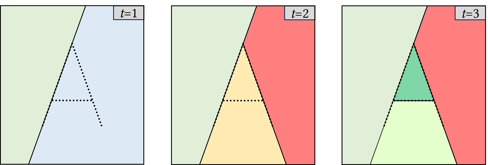

# Summary

*abspy* is a Python library for 3D adaptive binary space partitioning and modeling. At its core, *abspy* constructs a plane arrangement by recursively subdividing 3D space with planar primitives to form a linear cell complex that reflects the underlying geometric structure of the data. This adaptive approach iteratively refines the spatial decomposition, enabling efficient modeling and analysis. Built on robust computational techniques and data structures designed for interoperability, *abspy* offers a flexible framework that supports advanced operations such as surface reconstruction, volumetric analysis, and feature extraction for machine learning.

# Statement of need

Many applications—from remote sensing and robotics to computer graphics—require efficient methods for representing and analyzing complex 3D spaces. Fixed-grid (e.g., voxels) and exhaustive [@edelsbrunner1986constructing] approaches often struggle to capture the intricate geometry of data or incur prohibitive computational costs. Adaptive binary space partitioning [@murali1997consistent] overcomes these challenges by dynamically subdividing 3D space according to its intrinsic geometric features and constructing a plane arrangement that faithfully reflects the data structure, as shown in \autoref{fig:2d}. With its modern, user-friendly interface built on this adaptive mechanism, *abspy* enables accurate and efficient 3D modeling and analysis, allowing researchers to tackle large-scale and complex reconstruction challenges with great reliability and precision. Moreover, unlike geometric libraries such as CGAL [@fabri2009cgal] and Open3D [@zhou2018open3d], which primarily offer versatile low-level tools, abspy uniquely integrates adaptive binary space partitioning and exact arithmetic within a high-level Python-native framework, facilitating direct integration into research workflows tailored specifically for compact and dynamic 3D modeling tasks.

{ width=85% }

Initially designed for research purposes, *abspy* has since evolved to support a wide range of 3D applications, particularly for compact surface reconstructions. It has been employed in various research projects and featured in several scientific publications [@chen2022points2poly; @chen2024polygnn; @sulzer2024concise] as well as graduate students' projects.

# Overview of features

The core features of *abspy* include:

- **Planar primitive manipulation:** *abspy* extracts planar primitives from point clouds or meshes, and refines or perturbs the primitives to control noise, ensuring a robust representation of the input geometric structures.
- **Linear cell complex construction:** Using adaptive binary space partitioning, *abspy* recursively subdivides 3D space into a cell complex that reflects the data’s spatial layout. This structured decomposition facilitates efficient spatial queries and further processing.
- **Dynamic graph generation:** The package iteratively constructs and updates a BSP-tree as a dynamic graph, supporting operations like connectivity analysis and neighborhood searches.
- **Robust spatial operations:** By leveraging the rational ring from SageMath [@sage2024sage], *abspy* performs exact geometric computations that avoid inaccuracies associated with floating-point arithmetic, leading to reliable intersection tests and robust boundary determinations.
- **Surface reconstruction:** *abspy* identifies boundaries between interior and exterior cells to reconstruct polygonal surfaces using graph cuts, enabling the generation of surface models suitable for visualization and analysis.
- **Ease of integration:** With a Pythonic interface, comprehensive documentation, and practical examples, *abspy* integrates smoothly into existing research workflows. Its data structures are designed for interoperability with tools such as NetworkX [@hagberg2008exploring] and Easy3D [@nan2021easy3d], facilitating further development.

{ width=95% }

\autoref{fig:3d} provides an overview of the representations offered by *abspy*. The [documentation of *abspy*](https://abspy.readthedocs.io/) contains examples of the library, its API reference, file format specifications, etc.

# Acknowledgements

I acknowledge the feedback provided by [Liangliang Nan](https://github.com/LiangliangNan), [Hugo Ledoux](https://github.com/hugoledoux), Yuqing Wang, and Qian Bai, which greatly contributed to the development of this package.

# References
