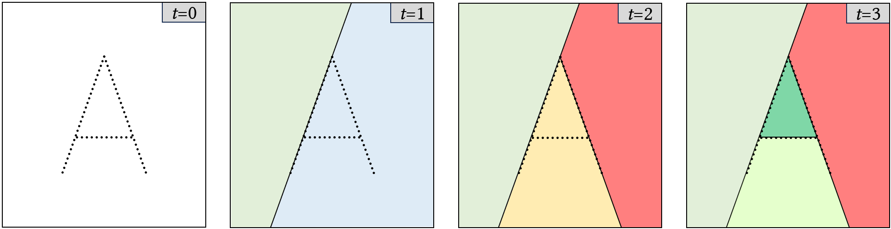

# Summary
*abspy* is a Python library for 3D adaptive binary space partitioning and modeling. At its core, *abspy* constructs a plane arrangement by recursively subdividing 3D space with planar primitives to form a linear cell complex. This adaptive approach iteratively refines the spatial decomposition based on the primitives, enabling efficient modeling and analysis. Built on robust computational techniques, *abspy* offers a flexible framework supporting advanced operations such as surface reconstruction, volumetric analysis, and feature extraction for machine learning.

# Statement of need
Many applications—from remote sensing and robotics to computer graphics—require efficient methods for representing and analyzing complex 3D spaces. Fixed-grid (e.g., voxels) and exhaustive [@edelsbrunner1986constructing] approaches often struggle to capture the intricate geometry of data or incur prohibitive computational costs. Adaptive binary space partitioning [@murali1997consistent] overcomes these challenges by dynamically subdividing 3D space according to its intrinsic geometric features and constructing a plane arrangement that faithfully reflects the data structure, as shown in \autoref{fig:2d}. With its modern, user-friendly interface built on this adaptive mechanism, *abspy* enables accurate and efficient 3D modeling and analysis, allowing researchers to tackle large-scale and complex reconstruction challenges with great reliability and precision.

{ width=80% }

Initially designed for research purposes, *abspy* has since evolved to support a wide range of 3D applications, particularly for compact reconstructions. It has been employed in various research projects and featured in several scientific publications (e.g., [@chen2022points2poly, @chen2024polygnn, @sulzer2024concise]) as well as graduate students projects.

# Overview of features
The core features of *abspy* include:
- **Planar primitive manipulation:** Extract and refine planar features from point clouds or meshes.
- **Linear cell complex construction:** Employ adaptive binary space partitioning to create a cell complex that reflects the spatial layout of the data.
- **Dynamic graph generation:** Construct and update a BSP-tree represented as a graph to facilitate graph-based operations.
- **Robust spatial operations:** Utilize the rational ring from SageMath [@sage2024sage] to ensure exact geometric computations.
- **Surface reconstruction:** Extract polygonal surfaces by determining boundaries between interior and exterior cells.
- **Ease of integration:** Provide a Pythonic interface with comprehensive documentation and examples, streamlining integration into research workflows with data structures designed for interoperability with tools such as NetworkX [@hagberg2008exploring] and Easy3D [@nan2021easy3d].

{ width=80% }

\autoref{fig:3d} provides an overview of the representations offered by *abspy*. The [documentation of *abspy*](https://abspy.readthedocs.io/) contains examples of the library, its API reference, file format specification, etc.

# Acknowledgements
I gratefully acknowledge the help of [Liangliang Nan](https://github.com/LiangliangNan) and [Yuqing Wang](https://github.com/wangyuqing0424) in the development of this package.

# References
